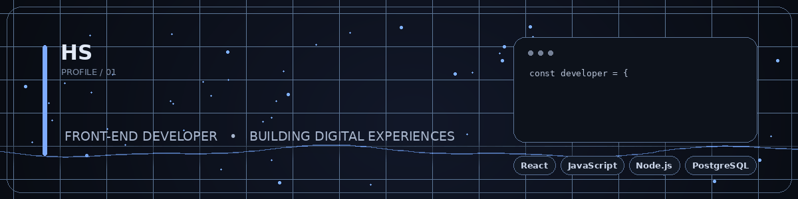

  # Henrique Sena 

  
 <!-- HEADER ANIMADO -->  <!-- TEXTO ANIMADO (TYPING SVG) -->     
  

<!--

  

 -->

Sou desenvolvedor Front-end apaixonado por transformar ideias em experiências digitais modernas, funcionais e responsivas.

- 🎨 Gosto de transformar layouts do Figma em aplicações reais, unindo design, código e funcionalidade.
- 🧠 Atualmente aprofundando meus conhecimentos no ecossistema JavaScript, evoluindo para desenvolvimento Full Stack.
- 🌱 Estudando Node.js, APIs e PostgreSQL.
- 💬 Fale comigo sobre UI/UX, Clean Code e desenvolvimento web moderno.
- ⚡ "Always building. Always learning."
 

<!--
<h2>Sobre mim</h2>
      

        Sou desenvolvedor <strong>Front-end</strong> apaixonado por transformar
        ideias em experiências digitais modernas, funcionais e responsivas.
      

      

        Gosto de transformar conceitos e layouts do <strong>Figma</strong> em
        aplicações reais, buscando unir design, código e funcionalidade.
      

      

        Atualmente, estou aprofundando meus conhecimentos no ecossistema
        <strong>JavaScript</strong> e evoluindo cada vez mais em
        <strong>desenvolvimento Full Stack</strong>.
      

  -->
### 💻 Tech Stack

  
  

<!--
### 💻 Tech Stack

  

  -->
github-readme-stats-13kmvjhzx-henrique-senas-projects.vercel.app
github-readme-stats-seven-omega-43.vercel.app

     

 

🚀 Projetos em destaque

     

2023 ── 🌱 Primeiros passos em HTML, CSS e JavaScript
  │
2024 ── 🎨 Comecei a converter layouts do Figma em páginas reais
  │       (Repository-Tailwind, cinemark)
  │
2025 ── ⚙️ Explorando frameworks front-end
  │       (Vue.js → Vue_Pizzaria)
  │
2026 ── 🚀 Aprofundando em JavaScript moderno e dando os
  │       primeiros passos rumo ao Full Stack
  │       (Node.js, APIs, PostgreSQL)
  │
Hoje ── 💻 Construindo, aprendendo e evoluindo a cada projeto

🥚 Easter Egg

 
🕹️ Clique aqui se você leu o README até o fim... (Konami Code ativado)
  
↑ ↑ ↓ ↓ ← → ← → B A
Você encontrou o easter egg! 🎉

Curiosidade real sobre mim:

☕ Café é praticamente uma dependência de build no meu ambiente de dev.
🐛 Meu bug favorito de resolver é aquele que "só acontece em produção".
🎧 Codo melhor com uma boa playlist lo-fi tocando.

Se você chegou até aqui, que tal deixar uma ⭐ em algum dos meus repositórios?

  

📬 Contato

   
   
  

<!--
<table>
  <tr>
    <td align="center" width="33%">
      <strong>🎯 Focus</strong>  
      Front-end Development 
      Full Stack
    </td>
    <td align="center" width="33%">
      <strong>🧠 Learning</strong>  
      Node.js 
      APIs 
      PostgreSQL
    </td>
    <td align="center" width="33%">
      <strong>🎨 Interests</strong>  
      UI/UX 
      Clean Code 
      Modern Web
    </td>
  </tr>
</table>

 

  <i>"Always building. Always learning."</i>

<h2>📊 Developer Dashboard</h2>

<table>
  <tr>
    <td align="center" width="33%">
      <strong>🚀 Projects</strong>  
      <h2>08</h2>
    </td>
    <td align="center" width="33%">
      <strong>📦 Repositories</strong>  
      <h2>12</h2>
    </td>
    <td align="center" width="33%">
      <strong>🔥 Contributions</strong>  
      <h2>327</h2>
    </td>
  </tr>
</table>

 

<table>
  <tr>
    <td align="center">
      <strong>⚡ Current Focus</strong>  
      React • Node.js • APIs • PostgreSQL • Full Stack Development
    </td>
  </tr>
</table>

 

### 📈 Most Used Languages

  

 -->
